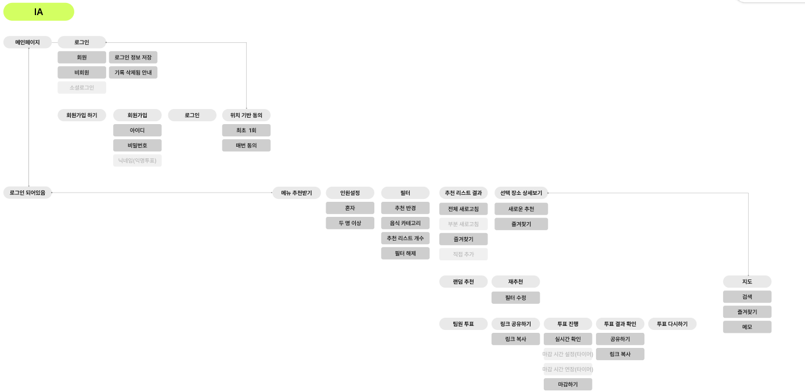
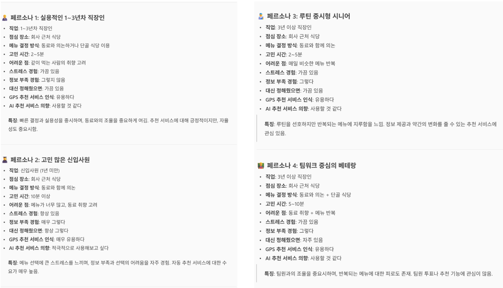
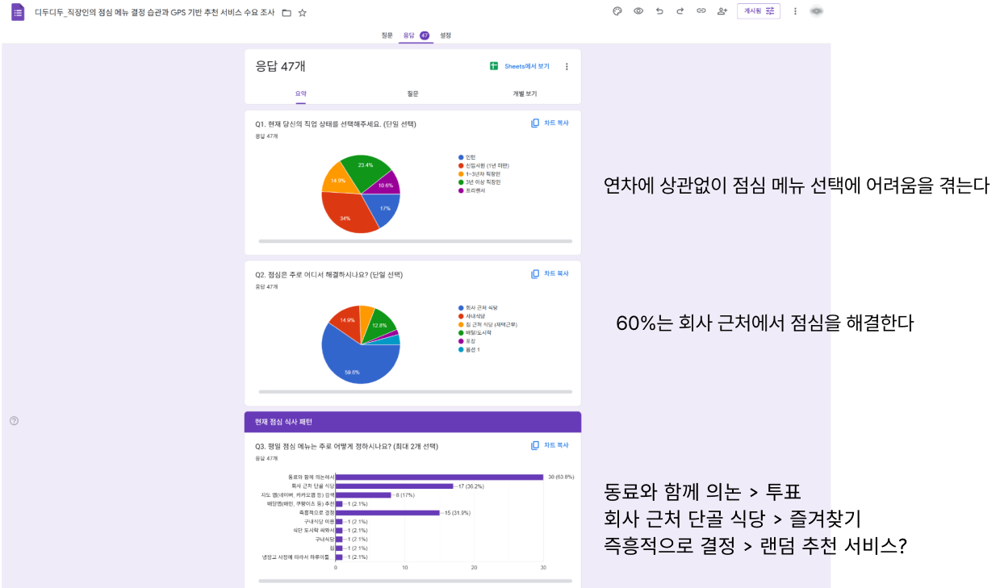
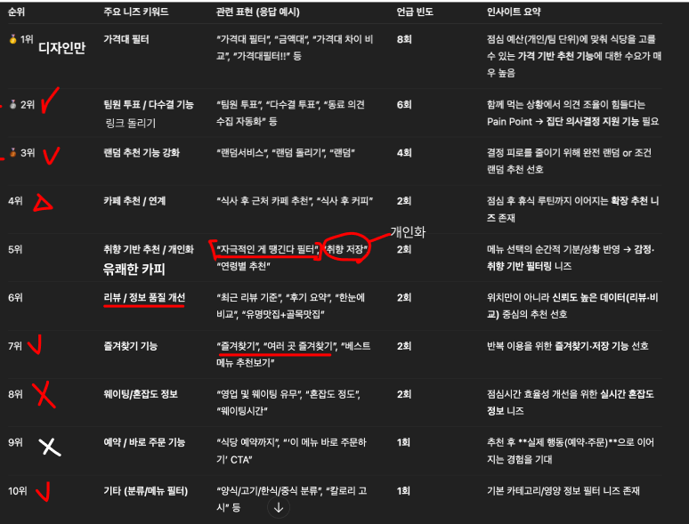
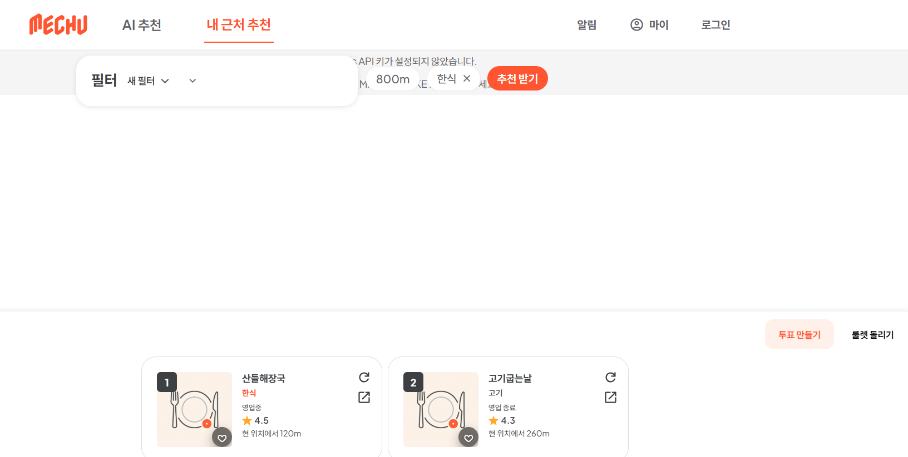
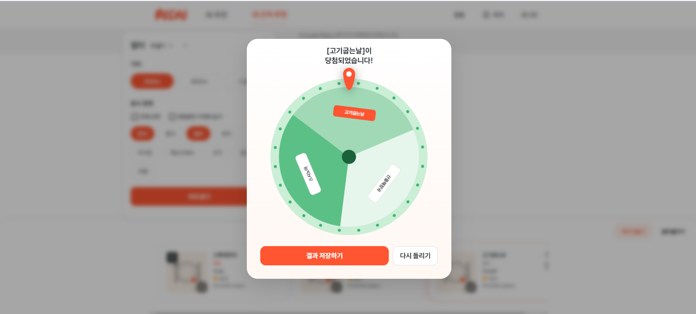

# 🍱 lunch-recommendation

[](https://github.com/wongi-jeong/lunch-recommendation/actions/workflows/ci.yml)


ユーザーの**位置と好み**をもとにランチメニューを推薦するフルスタック Web アプリケーションです。
Google Places で周辺の飲食店を検索し、フィルター・ルーレット・投票・お気に入りで「今日なに食べる？」をみんなで決めます。

> 🇰🇷 한국어版: [README.md](README.md) · チームプロジェクト（開発2・デザイン2・企画/リサーチ共同、役割は下記 [チーム](#チーム-team)参照）

## 企画・リサーチ

やみくもにコーディングから始めず、**課題定義 → ユーザーアンケート → ペルソナ → ニーズ優先順位 → IA 設計**を経て開発に着手しました。

- **課題定義** — 「毎日のランチ選びの煩わしさ」
- **ユーザーアンケート（回答 47件）** — 年次に関係なくメニュー選択に苦労 / 約 **60%** が会社近くでランチ / 決め方は *同僚と相談(64%) · 近所の常連店(36%) · 即興(32%)* → それぞれ **投票 · お気に入り · ランダム推薦** 機能へ
- **ペルソナ4種** — 実用的な1〜3年目社員 / 悩みの多い新入社員 / ルーティン重視シニア / チームワーク重視ベテラン
- **ニーズ優先順位 → 機能定義** — アンケートから導いたニーズを順位化し、優先度の高いものから実装
  - 実装: チーム投票・多数決、ランダム推薦、お気に入り、カテゴリフィルター
  - デザイン/企画段階: 価格帯フィルター、好みベースのパーソナライズ
  - スコープ外: 待ち時間・混雑度、予約・直接注文
- **IA（情報構造）** 設計で画面フローを確定し、デザイン → 開発へ

| IA | ペルソナ | アンケート | ニーズ優先順位 |
|---|---|---|---|
|  |  |  |  |

## デザイン

- **デザイナー2名**が Figma でデザインシステムと画面・コンポーネントを設計
- **Figma Dev Mode MCP** を用いて Figma コンポーネントをフロントエンド(Vue)へ反映 — デザイン⇄開発のハンドオフを一貫して自動化
- 🎨 **デザインファイル**: [Diduga_Design (Figma)](https://www.figma.com/design/E64gTfIyewiOjxKSIDBCWk/Diduga_Design?node-id=0-1)

## 主な機能

- **位置ベースの周辺飲食店推薦** — Google Places API で現在地周辺の飲食店を取得
- **フィルター** — カテゴリ（飲食店／カフェ等）・営業中(openNow)・半径フィルター、推薦カード個別更新
- **ランチルーレット** — 回転アニメーション + 当選結果の共有
- **投票** — 投票の作成/共有/終了、結果の地図表示、終了通知
- **お気に入り・保存フィルター** — よく行く店・よく使う検索条件を保存(CRUD)
- **会員・認証** — 会員登録/ログイン/マイページ/プロフィール/退会 (Spring Security + BCrypt)
- **地図** — Google Maps で位置・経路・情報ウィンドウを表示

## 技術スタック

| 領域 | スタック |
|---|---|
| Backend | Java 25, Spring Boot 3.5, Spring Security, Spring Data JPA, MySQL, Google Places API |
| Frontend | Vue 3, Vue Router, Vite |
| Tooling | Spotless (Java フォーマット), GitHub Actions (CI) |

## アーキテクチャ

```
[Vue 3 / Vite]  --(/api プロキシ)-->  [Spring Boot REST]  -->  [MySQL]
      |                                      |
  Google Maps JS                       Google Places API
 (VITE_GOOGLE_MAPS_API_KEY)           (GOOGLE_MAPS_API_KEY)
```

地図表示はクライアント（ブラウザ）、飲食店検索はバックエンドでそれぞれ Google API を呼び出します。開発時はフロントが `/api` をバックエンド(`localhost:8080`)へプロキシします(`vite.config.js`)。

## 前提条件

- **Docker で実行（推奨）:** Docker Desktop / Docker Compose だけで OK。（MySQL・JDK・Node のインストール不要）
- **ローカルで直接実行:** JDK 25, Node.js ≥ 22.12（または 20.19）, MySQL 8+
- **Google Maps API キーは任意** — なければ**デモモード**（サンプルデータ）で動作します。実データ・地図を使うにはサーバー側(Places API)・クライアント側(Maps JavaScript)のキーを発行してください。

## Docker で実行（最も簡単）

MySQL のインストールも Google キーもなしで、**一発で**起動します（デモモード既定）。

```bash
docker compose up --build
```

MySQL・バックエンド・フロントがコンテナで一緒に起動します。その後:

1. ブラウザで **http://localhost:5173** にアクセス
2. **料理の種類を1つ以上選択**して**推薦を受ける**をクリック
3. **位置情報を許可**（拒否しても既定位置で動作）→ **サンプル飲食店の推薦カード**が表示
4. ルーレット・投票・お気に入りも動作（お気に入り・マイページ等のパーソナライズはログイン後）

> デモモードでは実際の**地図タイルのみ**表示されません（クライアントキーが必要）。推薦リスト・ルーレット・投票などは正常です。

実際の Google データ/地図を使うには `.env` にキーを入れて再ビルド：

```bash
cp .env.example .env      # GOOGLE_MAPS_API_KEY / VITE_GOOGLE_MAPS_API_KEY を入力
docker compose up --build
```

> 以下「実行方法」は Docker なしでローカルで直接起動する手順です。

## 実行方法

### 1) データベース

```sql
CREATE DATABASE lunch_recommendation;
```

### 2) バックエンド

```bash
cd backend
cp src/main/resources/application.properties.example src/main/resources/application.properties
# application.properties に DB 認証情報と GOOGLE_MAPS_API_KEY を入力
./gradlew bootRun          # http://localhost:8080
```

### 3) フロントエンド

```bash
cd frontend
cp .env.example .env
# .env に VITE_GOOGLE_MAPS_API_KEY を入力
npm install
npm run dev                # http://localhost:5173 (/api → バックエンドへプロキシ)
```

## 実データで使う（Google キー — 任意）

デモモード（サンプルデータ）でも十分試せますが、**実際の周辺飲食店・地図**を使うには Google Maps API キーを発行して設定します。[Google Cloud Console](https://console.cloud.google.com) で:

- **Places API (New)** を有効化 → サーバー側キー → `GOOGLE_MAPS_API_KEY`
- **Maps JavaScript API** を有効化 → クライアント側キー → `VITE_GOOGLE_MAPS_API_KEY` *(HTTP リファラー制限を推奨)*

Docker ならルートの `.env` に、ローカル実行なら `application.properties`・フロント `.env` に入れます。キー設定後 `docker compose up --build` で再ビルドすると実データと地図が表示されます。（低使用量は月間無料枠内でほぼ無料）

## 環境変数

| 場所 | 変数 | 説明 |
|---|---|---|
| backend (`application.properties`) | `GOOGLE_MAPS_API_KEY` | サーバー側 Google Places API キー。OS 環境変数でも可 |
| backend | `spring.datasource.*` | MySQL 接続情報 |
| frontend (`.env`) | `VITE_GOOGLE_MAPS_API_KEY` | クライアント側 Google Maps JS キー |

> ⚠️ **キーのセキュリティ**: クライアントの地図キーはブラウザに露出するため、Google Cloud で必ず **HTTP リファラー制限**を設定し、サーバー側キーと**分離**してください。`application.properties`・`.env` は `.gitignore` によりコミットされません。

## デモ


*位置ベースの周辺飲食店推薦 + カテゴリ/営業中フィルター*


*ランチルーレットとチーム投票*

## チーム (Team)

| 名前 | 区分 | 担当 |
|---|---|---|
| **정원기 / Wongi Jeong** ([@wongi-jeong](https://github.com/wongi-jeong)) | 開発（主導） | バックエンド推薦ロジック・**Google Places 連携**、飲食店/会員/投票ドメイン・DB 設計、フロントエンドの大部分（認証・ルーレット・投票・お気に入り・地図・フィルター UI） |
| **Heesun Hong** ([@h3136514](https://github.com/h3136514)) | 開発 | プロジェクト初期セットアップ（フロント/バック）、リポジトリ管理 |
| **김주희 / Kim Juhui** | デザイン | Figma デザインシステム・画面・コンポーネント設計 |
| **장유진 / Jang Yujin** | デザイン | Figma デザインシステム・画面・コンポーネント設計 |

> **企画・リサーチ**（課題定義・競合調査・ユーザーアンケート・ペルソナ）はチーム共同。開発コントリビューションはコミット履歴（`git shortlog -sne`、ブランチ別の変更履歴）で確認できます。
